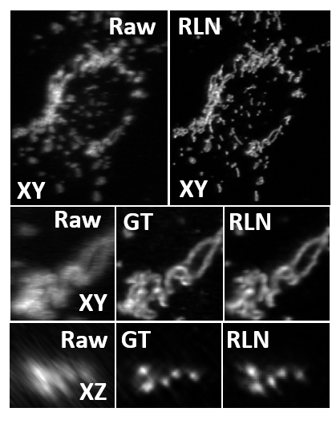

# A deeplearning network based on Richardson-Lucy formula (Richardson-Lucy network, RLN)

RLN is the companion code to our paper:

[Incorporating the image formation process into deep learning improves network performance in deconvolution applications](https://www.biorxiv.org/content/10.1101/2022.03.05.483139v1).

RLN is a 3D fully convolutional deep learning incorporating the Richardson-Lucy deconvolution formula to restore and enhance the resolution of fluorescence microscopy image.

## System Requirements

- Ubuntu 16.04.
- Python 3.6+
- NVIDIA GPU
- CUDA 10.1.243 and cuDNN 7.6.4
- Tensorflow 1.14.0

Tested Environment:

single-view RLN (for single GPU with 24 GB):
    - RLN model (./Test_model_based_on_data)
    - Ubuntu 16.04
    - Python 3.6
    - NVIDIA TITAN RTX 24GB
    - CUDA 10.0 and cuDNN 7.6.4
    - Tensorflow 1.14.0
    
## Dependencies Installation
If using conda, conda install tifffile -c conda-forge.
Otherwise, pip install tifffile.
RLN itself does not require installation, please just download the code and only takes few seconds on a typical PC.
Maybe you need to install numpy, tifffile and other package.
    

## Dataset

We upload a U2OS mitochondria dataset for testing (./RLN_data)

## Training

Before you train a RLN model, we reconmmend you to create the folders as follow:

    Main folder (rename as you like):
      -- train
            --input
            --(input2) for dual-input mode
            --ground truth
            --model_rl
            --output_rl
            --labels.txt (containing the input raw name)
      -- test
            --input
            --(input2) for dual-input mode
            --(ground truth) for validation
            --output_rl
            --labels.txt

We put the RLN code in the (./RLN_data). There are configuration for single-input RLN and dual-input RLN. 

makedata3D_train_single.py and makedata3D_train_dual.py are the data loading and preprocessing files for single-input and dual-input training respectively.
makedata3D_test_single.py and makedata3D_test_dual.py are the data loading and preprocessing files for single-input and dual-input testing respectively.

After preparing the dataset and relative folders, you can set the main parameters for train in the RLN-single.py or RLN-dual.py:

mode: TR:train ; VL:validation, with known ground truth ; TS: test , no ground truth; TSS: test and with stitch (only in RLN-single)
relative folders:
data_dir = '/home/liyue/newdata1/' # the main folder including the train and test folders
model_path='/home/liyue/newdata1/train/model_rl/new_single_used/' #the folder for the trained model to be saved
train_output='/home/liyue/newdata1/train/output_rl/' #the train output saved folder
test_output='/home/liyue/newdata1/test/output_rl/' # the validating output or testing output folders

train_iter_num=iter_per_epoch*epochs
test_iter_num=testing_data_numbers
train_batch_size=as you want
test_batch_size=1

and you can set the learning rate in:
self.learning_rate = tf.train.exponential_decay(0.02,self.global_step,1000,0.9,staircase=False)

After you setting these parameters, you can run: python RLN-single.py or python RLN-dual.py

During training, put training dataset into the input folder and ground truth folder, each input/ground truth (input2) image pair share the same file name. Labels.txt summary the name of all the image pairs. model_rl folder is used to save the trained model. The output_rl model is used to save the output during training, this is not necessary and just to supervise the training procedure.

For 200 epochs with 100 iteration/epoch, it cost 2-3 hours to train the model.

## Model Apply

During testing, put testing dataset into the input folder and list the testing data name into the labels.txt. The output_rl model is used to save the test result. If you have ground truth, you can try validation to metric the difference between the output and ground truth.

## License

Copyright © 2021 [SVision Technologies LLC.](https://www.aivia-software.com/)

Released under Creative Commons Attribution-NonCommercial 4.0 International Public License ([CC BY-NC 4.0](https://creativecommons.org/licenses/by-nc/4.0/))
